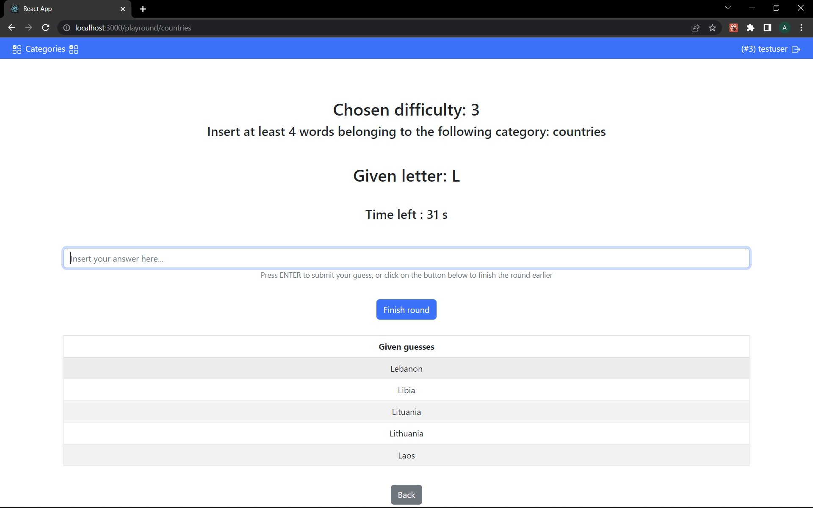

# Categories
Final project for Web Application I exam


This is the final version of the project I committed for my Web Application exam at Polito, which got me a pretty high score (27/30).
It's a simple single page application, implementing a very simple game of categories: you get a letter and a category, you give as many guesses as possible in one minute.

It's a complete version, with both frontend (made mainly with React.js and Bootstrap frameworks) and backend (a simple node.js server with a sqlite3 DB).

How to install (very simple):
- Clone this repo;
- cd the client folder, and run a simple 'npm install' to install all the dependencies needed;
- do the same with the server folder;
- run the server with a simple 'node index.js' while in the server folder, then launch the app by running 'npm start' in another terminal window (while being in the client folder);
- have fun!

DISCLAIMER: it's not a perfect project, it was made for didactical purposes, it has a few flaws ant lots of stuff that could be surely improved. If you want to try it out, and then work on it on your own to improve it, feel free to do so!


Original README file of the project:
# Exam #3: "Categorie"
## Student: Torredimare Andrea 

## React Client Application Routes

- Route `/`: homepage, where welcome menu is shown
- Route `/login`: contains login form
- Route `/playround/:category`: where a round is played
- Route `/history/:username`: shows round history for a logged user
- Route `/halloffame`: shows the hall of fame

## API Server
### Validate a round
- PUT `/api/validateround`
  - Method: PUT
  - Description: validate a round (compute score, saves round and updates word usage)
  - Request body: an object containing the array of words, the category, the letter of the round, the difficulty and the username (name). For example:
    ```
    {
      ["word1","word2",...],
      category: "animals",
      givenLetter: "B",
      difficulty: 2,
      username: "testuser",
    }
    ```
  - Response: `422 Unprocessable Entity` (validation error), `503 Service Unavaliable` (generic error),  `200 Ok` (if successful or if not enough words to pass the round)
  - Response body: an array of objects each describing a validated word. For example:
    ```
    [
      {
        word: "Word1",
        score: "20",
      },
      {
        word: "Word2",
        score: "10",
      }
      ...
    ]
    ```
- GET `/api/history/:username`
  - Method: GET
  - Description: retrieves the round history for a user
  - Request body: _None_
  - Response: `200 Ok` (if successful), `500 Internal Server Error` (generic error)
  - Response body: an array of objects, each describing a round. For example:
    ```
    [
      {
        roundId : 1,
        username: "testuser",
        score: 200,
        category: "animals",
        letter: "E",
      }
      ...
    ]
    ```
### Get the best user for a category
- GET `/bestin/:category`
  - Method: GET
  - Description: retrieves the top-score user for the given category
  - Request body: _None_
  - Response: `200 Ok` (if successful), `500 Internal Server Error` (generic error)
  - Response body: an array of objects, one for each user, containing the username and the sum of the scores for the category
    ```
    [
      {
        username: "Andrea",
        score: 310,
      }
      ...
    ]  
    ```
### User login
- POST `/api/sessions`
  - Method: POST
  - Description: logs the user in, checking provided credentials
  - Request body: an object containing the credentials provided by the login form
    ```
    {
      "username":"mario.rossi@polito.it",
      "password":"password"
    }
    ```
  - Response: `200 Ok` (if successful),  `401 Unauthorized` (login error)
  - Response body: some info on the logged user
    ```
    {
      "id":3,
      "username":"mario.rossi@polito.it",
      "name":"Mario"
    }
    ```
### User logout
- URL: '/api/sessions/current'
  - Method: DELETE
  - Description: logs the user out, deleting the session
  - Request body: _None_
  - Response: `200 Ok`
  - Response body: _None_

### Check login
- URL: '/api/sessions/current'
  - Method: GET
  - Description: check whether the user is logged in or not
  - Request body: _None_
  - Response: `200 Ok` (if successul), `401 Unauthorized` (if not logged in)
  - Response body: some info on the logged user
      ```
      {
          "id":3,
          "username":"mario.rossi@polito.it",
          "name":"Mario"
      }
      ```


## Database Tables

- Table `rounds` - stores all the valid rounds 
- Table `users` - contains information about users
- Table `words` - stores all the correct words


## Main React Components

### HallOfFame.js
- `HallOfFame`: contains the top-scoring user, for each category

### LoginComponent.js
- `LoginForm`: contains perform to insert the credentials for login

### Navbar.js
- `Navbar`: renders the navbar and the icons at the top of the page

### RoundComponent.js
- `Round`: container for all the sub-components of the page, including buttons for choosing difficulty, the form for submitting the guesses and tables
- `ProvGuessesTable`: contains all the guesses inserted by the user, before submitting to the server for correction
- `DefGuessesTable`: contains the words validated by the server, highligting correct and wrong ones, and the total score of the table
- `PageTitle`: header titles for the form
- `Timer`: contains the timer

### RoundHistoryComponent.js
- `RoundHistory`: contains a table with information about all the rounds played by the user

### WelcomeMenu.js
- `WelcomeMenu`: contains the welcome menu for anonymous users
- `LoggedWelcomeMenu`: contains the welcome menu for logged users
- `RoundCards`: contains the cards for the avaliable categories (leeds to the round start)


## Screenshot



## Users Credentials
- john.doe@polito.it : password
- mario.rossi@polito.it : password 
- andrea@torredimare.it : password
- torredp@libero.it : password
